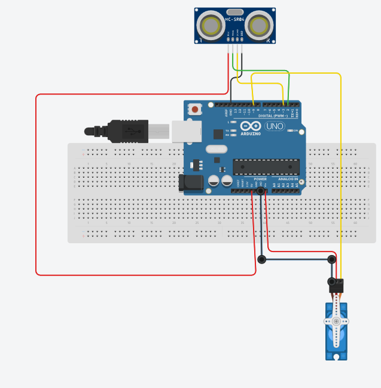

# Smart Dustbin using Arduino Uno

A contactless smart dustbin that automatically opens its lid when you bring trash near it. Built with Arduino Uno, HC-SR04 ultrasonic sensor, and a servo motor.

##  Table of Contents
- [Features](#features)
- [Components Required](#components-required)
- [Circuit Diagram](#circuit-diagram)
- [Code](#code)
- [Working Principle](#working-principle)
- [How to Use](#how-to-use)
- [Full Report](#full-report)
- [License](#license)

##  Features
- Touch-free operation (opens within 30 cm)
- Auto-closes after 2 seconds
- Low power consumption
- Low cost and easy to build

##  Components Required
| Component | Quantity |
|-----------|----------|
| Arduino Uno | 1 |
| HC-SR04 Ultrasonic Sensor | 1 |
| Servo Motor (SG90) | 1 |
| Jumper Wires | as needed |
| 9V Battery / USB Cable | 1 |
| Plastic Dustbin | 1 |

##  Circuit Diagram

##  Code
The Arduino code is available here:  
[`code/smart_dustbin.ino`](code/smart_dustbin.ino)

##  Working Principle
1. Ultrasonic sensor sends sound waves.
2. If an object is within 30 cm, Arduino rotates servo motor to 120° (lid open).
3. After 500 ms, servo returns to 0° (lid closed).

##  How to Use
1. Upload `code/smart_dustbin.ino` to Arduino Uno using Arduino IDE.
2. Connect components as per circuit diagram.
3. Power the Arduino (9V battery or USB).
4. Bring your hand near the sensor – lid opens automatically.
5. After disposing waste, step back – lid closes.

##  Full Report
[Download PDF Report](docs/Smart_Dustbin_Final_Report.pdf)

## 📜 License
This project is licensed under the MIT License – see the [LICENSE](LICENSE) file.

## 👨‍💻 Author
**HPusswella** – [GitHub Profile](https://github.com/HPusswella)
